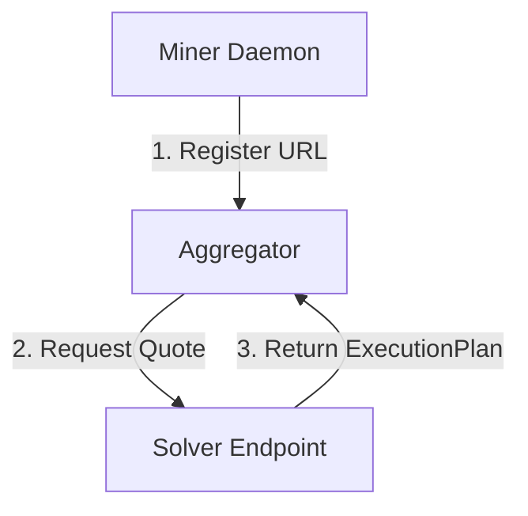

# Minotaur Solver Guide

## Table of Contents
- [Overview](#overview)
- [Solver Protocol Specification](#solver-protocol-specification)
  - [Roles & Responsibilities](#roles--responsibilities)
  - [API Interface (as implemented)](#api-interface-as-implemented)
  - [JSON Data Structures (as implemented)](#json-data-structures-as-implemented)
- [Implementation Reference (Language Agnostic)](#implementation-reference-language-agnostic)
  - [Quote Generation Flow](#quote-generation-flow)
  - [Execution Plan Construction](#execution-plan-construction)
- [Testing with Simulation](#testing-with-simulation)
- [Integration](#integration)

## Overview
Solvers are the core engines of the Minotaur subnet. Their goal is to find the best execution path for a user's swap intent. When a user submits an intent (e.g., "Swap 100 USDC for WETH"), the Aggregator broadcasts this intent to all registered solvers. Solvers compete to provide the most profitable route (highest output amount) while respecting the user's constraints.

## Solver Protocol Specification

This section defines the communication protocol between the Minotaur Miner and the Solver. You can implement the solver in any language (Python, Rust, Go, JavaScript) as long as it exposes an HTTP server adhering to this specification.

### Roles & Responsibilities
*   **Miner (Python)**: Responsible for **Registration** and **Lifecycle Management**.
    *   Generates the identity (hotkey).
    *   Registers the Solver's URL with the Aggregator.
    *   Sends periodic heartbeats/updates to keep the registration active.
    *   *Does not* proxy quote traffic.
*   **Solver (Any Language)**: A standalone HTTP server directly accessible by the Aggregator.
    *   Listens on a public port.
    *   Receives `POST /quotes` requests **directly** from the Aggregator.
    *   Computes and returns the execution plan.

### Architecture Diagram


### API Interface (as implemented)

The Python sample solvers in this repo (`neurons/solver.py`, `neurons/solver_uv2.py`, `neurons/solver_base.py`) expose the endpoints below.

Notes:
* The **miner** uses `GET /health` and `GET /tokens` to wait for readiness and to build the registration payload.
* The **aggregator** calls `POST /quotes` directly on the solver endpoint.
* The sample solvers also expose `/orders` endpoints (used by the broader OIF v1 flow / local testing in this repo).

#### 1. Health Check
*   **Endpoint:** `GET /health`
*   **Description:** Used by the miner to verify the solver is ready.
*   **Requirement:** Must return HTTP Status `200 OK`.
*   **Response Body:** (Optional/Informational)
    ```json
    {
      "status": "healthy",
      "solver_id": "your-solver-id"
    }
    ```

#### 2. List Supported Tokens (required by miner in this repo)
*   **Endpoint:** `GET /tokens`
*   **Description:** Used by the miner at startup to discover what assets the solver supports (so it can include them in the aggregator registration payload).
*   **Requirement:** Must return HTTP Status `200 OK`.

**Request format (as implemented in this repo):**
- **Method/Path:** `GET /tokens`
- **Query params:** *(none)* — the sample solvers ignore query parameters and always return their full advertised set.
- **Headers:** none required. (If you front your solver with auth, you may require headers, but the miner in this repo does not send auth headers to `/tokens` today.)

**Response format (as implemented in this repo):**
- The response is a JSON object with a top-level `networks` map keyed by chain id (as a string).
- Each network entry includes:
  - `chain_id` (number)
  - `input_settler` / `output_settler` (settlement contract address the solver expects to use)
  - `tokens`: an array of `{ address, symbol, decimals }`

Example:

```json
{
  "networks": {
    "8453": {
      "chain_id": 8453,
      "name": "Base",
      "input_settler": "0x5aAdFB43eF8dAF45DD80F4676345b7676f1D70e3",
      "output_settler": "0x5aAdFB43eF8dAF45DD80F4676345b7676f1D70e3",
      "tokens": [
        { "address": "0x4200000000000000000000000000000000000006", "symbol": "WETH", "decimals": 18 },
        { "address": "0x833589fcd6edb6e08f4c7c32d4f71b54bda02913", "symbol": "USDC", "decimals": 6 }
      ]
    }
  }
}
```

Notes:
- This token list is for **capability advertisement** and miner registration. Quote requests still use **ERC-7930 interop addresses** under `asset` in `POST /quotes`.
- You can control how many tokens the sample solvers advertise via `MOCK_SOLVER_TOKEN_LIMIT` (default: 10000).

#### 3. Get Quotes
*   **Endpoint:** `POST /quotes`
*   **Description:** Receives a user intent and returns one or more execution plans.
*   **Content-Type:** `application/json`

Headers sent by the OIF Aggregator (OIF-v1 adapter):
* `User-Agent: OIF-Aggregator/1.0`
* `X-Adapter-Type: OIF-v1`
* `Authorization: Bearer <token>` (only if configured for the solver)
* Additional custom headers may be configured per solver in the aggregator config.

#### 4. (Optional, implemented by sample solvers) Orders
*   **Endpoint:** `POST /orders`
*   **Endpoint:** `GET /orders/<order_id>`
*   **Description:** Simple order submission + status APIs used by local/testing flows in this repo.

### JSON Data Structures (as implemented)

#### Request Body (The Intent)
The `POST /quotes` endpoint receives a JSON body describing the swap intent:

```json
{
  "user": "0x01...InteropAddress",    // ERC-7930 InteropAddress (hex-encoded)
  "availableInputs": [
    {
      "asset": "0x01...InteropAddress", // ERC-7930 InteropAddress (hex-encoded)
      "amount": "1000000",             // Raw amount (wei, decimal string)
      "user": "0x01...InteropAddress"  // ERC-7930 InteropAddress (hex-encoded)
    }
  ],
  "requestedOutputs": [
    {
      "receiver": "0x01...InteropAddress", // ERC-7930 InteropAddress (hex-encoded)
      "asset": "0x01...InteropAddress",    // ERC-7930 InteropAddress (hex-encoded)
       "minAmount": "0",                    // Optional minimum output (wei, decimal string; ignored by sample solvers today)
       "amount": "0"                        // Optional; sample solvers ignore this field on requests
    }
  ],
  "minValidUntil": 600,              // Optional: minimum validity duration (seconds)
  "preference": "speed"              // Optional: "price" | "speed" | "inputPriority" | "trustMinimization"
}
```
Notes:
- The Python sample solvers in this repo require `availableInputs[0].asset`, `availableInputs[0].amount`, and `requestedOutputs[0].asset`. Other fields may be present and are often ignored by the sample solvers.
- Addresses are serialized as **ERC-7930 hex** strings. The Python reference parser is `Solver._interop_to_components()` in `neurons/solver.py` / `neurons/solver_base.py`.

#### Response Body (The Quote)
The solver must return a JSON object with a `quotes` array. Each quote object MUST match this structure:

```json
{
  "quotes": [
    {
      "quoteId": "unique-quote-id", // Generated by solver
      "provider": "solver-id",      // Your solver ID
      "orders": [],                 // Usually empty for new quotes
      "validUntil": 1715000000,     // Optional: UNIX timestamp (seconds)
      "eta": 10,                    // Optional: estimated seconds
      "details": {
        "availableInputs": [
          {
            "asset": "0xInputToken...",
            "amount": "1000000",
            "user": "0xUser..."
          }
        ],
        "requestedOutputs": [
          {
             "asset": "0xOutputToken...",
             "amount": "995000",   // The quoted output amount
             "receiver": "0xUser..."
          }
        ]
      },
      "settlement": {               // Optional, but required if your solver uses the shared settlement flow
        "contractAddress": "0xSettlementAddr...",
        "deadline": 1715000000,
        "nonce": "0x...",         // Unique nonce for this plan (hex string in sample solvers)
        "callValue": "0",         // Total ETH value forwarded (decimal OR 0x-prefixed hex string)
        "gasEstimate": 150000,
        "interactionsHash": "0x...", // Canonical hash of the execution plan (validated by aggregator when enabled)
        "permit": {
           "permitType": "standard_approval", // "none" | "eip2612" | "eip3009" | "standard_approval" | "custom"
           "permitCall": "0x",                // Hex bytes (0x...); defaults to "" if omitted
           "amount": "1000000",               // Optional (string)
           "deadline": 1715000000             // Optional (u64)
        },
        "executionPlan": {
           "preInteractions": [],
           "interactions": [
              {
                "target": "0xRouter...",
                "value": "0",       // Decimal OR 0x-prefixed hex string
                "callData": "0x..." // Hex bytes (0x...)
              }
           ],
           "postInteractions": [],
           "blockNumber": "12345678" // Optional; present in sample solvers when known
        }
      }
    }
  ]
}
```
Notes:
- The `details` object must include **both** `availableInputs` and `requestedOutputs` arrays (the aggregator’s deserializer is strict for these nested fields).
- If `settlement` is present and the aggregator is configured with settlement allow-listing, it validates:
  - `interactionsHash` matches the canonical hash computed from `executionPlan`
  - `callValue` equals the sum of all `preInteractions[]/interactions[]/postInteractions[].value`

## Implementation Reference (Language Agnostic)

### Quote Generation Flow
1.  **Parse Request**: Extract input token, output token, and input amount from the JSON body.
2.  **Liquidity Search**: Query your liquidity sources (RPC calls to Uniswap, Curve, or off-chain data) to find the best route.
3.  **Construct Execution Plan**: If a route is found, build the `executionPlan` object. This defines the exact EVM calls the Settlement contract will make.

### Execution Plan Construction
The `executionPlan` is the most critical part. It tells the smart contract how to execute the swap. It consists of three arrays of "Interaction" objects:

*   **Target**: The smart contract to call (e.g., Uniswap Router).
*   **Value**: ETH amount to send (usually "0").
*   **CallData**: The ABI-encoded function call (hex string).

#### 1. Pre-Interactions
*   **Purpose**: Prepare the state for the swap.
*   **Critical**: You MUST assume the Settlement contract holds the user's funds. You must Approve the router to spend these funds.
*   **Example**: Call `approve(router_address, amount)` on the Input Token contract.
    *   *Tip*: Some tokens (like USDT) require resetting approval to 0 before setting a new value.

#### 2. Interactions
*   **Purpose**: The main swap logic.
*   **Example**: call `swapExactTokensForTokens(...)` on the Uniswap Router.
*   **Recipient**: The recipient of the swap output MUST be the **Settlement Contract** itself (or the User, depending on the settlement logic, but typically the Settlement contract validates the balance change).

#### 3. Post-Interactions
*   **Purpose**: Cleanup or bridging. Often empty for simple swaps.

## Testing with Simulation

The `minotaur_contracts` repository provides a Docker-based Simulator that validators use to check if an ExecutionPlan actually delivers the promised tokens. You should use this continuously during development to verify your solver's logic.

### Quick local testing (no Aggregator required)

This repo includes a small harness that simulates the key Aggregator/Miner calls against your solver and validates the response schema and invariants (including `interactionsHash` and `callValue`):

```bash
python -m tests.solver_harness --solver-url http://localhost:8000
```

### 1. Build the Simulator Image
Clone the `minotaur_contracts` repo and build the image:
```bash
cd minotaur_contracts
docker build -t mino-simulation .
```

### 2. Prepare Simulation Input
The simulator expects a JSON payload containing the `quoteDetails` (which maps to your `response.quotes[0]`) and a `signature`. Since you are testing locally, you can mock the signature or use a dummy one if validation is disabled in the script, but the strict simulator usually requires a signature. 

**Format:**
```json
{
  "quoteDetails": { ... your quote object ... },
  "signature": "0x..."
}
```

### 3. Run the Simulation
You can pipe your JSON payload directly into the docker container. You must provide an RPC URL for the chain you are simulating (e.g., Base).

```bash
cat payload.json | docker run -i --rm \
  -e SIM_FORK_URL="https://mainnet.base.org" \
  mino-simulation
```

### 4. Interpret Output
The simulator runs the `ExecutionPlanSimulator.s.sol` script using Foundry. It forks the chain using the RPC URL you provide and attempts to execute your plan.

#### Forking behavior (blockNumber)
If your payload includes `quoteDetails.settlement.executionPlan.blockNumber`, the simulator will:
- briefly fork **latest** to read the current block number (for staleness checks), then
- fork again at the **requested `blockNumber`** and run the simulation on that historical state.

If the requested block is considered **stale**, the simulator prints a warning that is treated as an error.

**Stale definition**: `latestBlock - blockNumber > 256` (i.e., more than 256 blocks behind latest; ~1 hour on Ethereum mainnet).

#### State preparation (balances, approvals, relayer)
Before executing your plan, the simulator prepares the forked state so the settlement call can run deterministically:

- **Settlement deployment**: deploys the `Settlement` contract at a fixed address (`0x5aAdFB43eF8dAF45DD80F4676345b7676f1D70e3`) for stable EIP-712 domain separation across runs.
- **User balance**: funds the `user` with `amountIn` of `tokenIn` on the fork.
  - For most ERC-20s it uses Foundry cheatcodes to mint/assign balance.
  - For **WETH** it uses a special-path (proxy contracts can be tricky for standard mint helpers).
  - For **Ethereum mainnet USDT** it writes the USDT balance storage slot directly (USDT’s storage layout breaks Foundry’s standard `deal()` approach).
- **Approvals**: the simulator has the user approve the settlement contract for `tokenIn` (max allowance) so `executeOrder()` can pull funds.
  - For **Ethereum mainnet USDT**, approval is done via a low-level call because USDT’s `approve()` does not return a boolean like standard ERC-20s.
- **Relayer funding**: funds a relayer address with `callValue + 1 ether`, then the relayer calls `settlement.executeOrder{value: callValue}(intent, plan)` on the fork.

**Success** returns JSON with the following fields:
```json
{
  "success": true,
  "quoteId": "quote-paper-11bb3d4f-0a60-4cf6-9788-5ccab44520c9",
  "settlement": "0x5aAdFB43eF8dAF45DD80F4676345b7676f1D70e3",
  "user": "0x9996E4253e938D81A360b353C4FCefa67E7120Bc",
  "receiver": "0x9996E4253e938D81A360b353C4FCefa67E7120Bc",
  "tokenIn": "0xA0b86991c6218b36c1d19D4a2e9Eb0cE3606eB48",
  "tokenOut": "0xC02aaA39b223FE8D0A0e5C4F27eAD9083C756Cc2",
  "amountIn": "1000000000",
  "amountOut": "304664226045999527",
  "receiverDelta": "304664226045999527",
  "feeAmount": "0",
  "gasUsed": "185432",
  "callValue": "0"
}
```

**Failure** returns JSON with:
```json
{
  "success": false,
  "errorData": "0x...",
  "errorMessage": "Human-readable error description...",
  // ... other fields (quoteId, settlement, user, etc.) may also be present
}
```

Use this feedback loop to debug Reverts, Gas limitations, or Slippage errors.

## Integration
To integrate your custom solver (e.g., written in Rust):
1.  Run your solver as a service on `localhost:8001`.
2.  Run the Minotaur Miner (Python) and point it to your solver's port.
    *   The miner handles the signing and broadcasting to the Bittensor network.
    *   In this repo, the miner also expects `GET /tokens` to be available so it can build the registration payload.
    *   Your solver needs to focus on the `POST /quotes` logic and returning a valid `settlement.executionPlan`.

## Security / Access Control (recommended)

In production, you should assume your solver endpoint will be scanned and spammed if it is publicly reachable. The Minotaur Aggregator treats solvers as HTTP endpoints; it does **not** require that your solver be open to the entire internet.

Minotaur operators will provide one or more **Aggregator egress IPs** (or CIDR ranges). You should restrict inbound traffic so **only the Aggregator can call your solver**.

### Recommended approach: network allowlist (firewall / security group)

- **Allow inbound** from the Aggregator IP(s) to your solver port (e.g., `8001`).
- **Deny inbound** from all other IPs.
- Keep egress open as needed for RPC access (Ethereum/Base RPCs, token lists, etc.).

Examples (Linux `ufw`):

```bash
# Allow aggregator -> solver port
sudo ufw allow from <AGGREGATOR_IP> to any port 8001 proto tcp

# Optionally allow multiple aggregators
sudo ufw allow from <AGGREGATOR_IP_2> to any port 8001 proto tcp

# Deny everyone else
sudo ufw deny 8001/tcp
sudo ufw enable
```

Examples (`iptables`):

```bash
# Allow aggregator IP(s)
sudo iptables -A INPUT -p tcp --dport 8001 -s <AGGREGATOR_IP> -j ACCEPT
sudo iptables -A INPUT -p tcp --dport 8001 -s <AGGREGATOR_IP_2> -j ACCEPT

# Drop everyone else
sudo iptables -A INPUT -p tcp --dport 8001 -j DROP
```

Examples (cloud security group):
- **AWS Security Group**: inbound rule `tcp/8001` source = `<AGGREGATOR_CIDR>`
- **GCP Firewall** / **Azure NSG**: same concept

### Reverse proxy allowlist (optional but common)

If you don’t want to expose your solver process directly, put it behind a reverse proxy (e.g., NGINX, Caddy, Envoy) and apply IP allowlisting there. This also lets you add:
- **TLS termination** (HTTPS)
- **Rate limiting**
- **Request size limits**
- **Basic auth / API key checks**

### App-layer auth (optional)

If your deployment requires an authentication token, ensure the Aggregator is configured to send it (e.g., `Authorization: Bearer ...` or a custom header like `X-API-Key`).

Important:
- The sample solvers in this repo do **not** enforce auth by default.
- If you enforce auth for `POST /quotes`, make sure you also decide whether `GET /health` / `GET /tokens` should be:
  - restricted to your miner host (if the miner calls locally), or
  - exposed to the Aggregator IP(s) as well (if the aggregator validates these endpoints).

### Operational hardening checklist

- **Bind to localhost** when possible, and expose publicly only via a hardened proxy.
- **Log and monitor** request rates and status codes.
- **Set timeouts** (read/write) so slowloris-style connections don’t exhaust worker threads.
- **Limit payload size** (JSON bodies) to prevent memory abuse.
- **Rate limit** `/quotes` and `/orders` (if exposed).

## Solvers and AI

The intersection of Artificial Intelligence and Execution Solvers represents the next frontier in DeFi optimization.

Important: **All AI/ML logic is entirely solver-side.** The Aggregator treats solvers as black boxes and only enforces the HTTP + JSON contract (`POST /quotes` request → `quotes[]` response). Any model usage, training, feature engineering, or inference is an internal implementation detail of your solver.

While traditional pathfinding algorithms (like Bellman-Ford or Dijkstra) are effective for finding routes in static snapshots, they struggle with the dynamic, adversarial nature of efficient blockchain execution.

Here are key areas where AI models can elevate solver performance:

### 1. Predictive Routing & Probabilistic Liquidity
Traditional solvers assume the state observed at block `N` will be valid at block `N+1`. In reality, other transactions (arbitrageurs, noise traders) shift the curve constantly.
*   **Deep Learning Models** can be trained on historical mempool and block data to predict *future* liquidity states.
*   *Application*: A model predicts that a specific Uniswap V3 pool has a high probability of a massive sell order in the next block. The solver avoids this pool or prices in the slippage *before* it happens, offering a safer quote than competitors.

### 2. Gas Price Forecasting
Gas volatility causes two major failures:
1.  **Reverts**: Bid too low, and the transaction stalls, likely failing the deadline.
2.  **Overpayment**: Bid too high to be safe, and you erode the user's surplus (and your win rate).
*   **LSTM / Transformer Models** can analyze time-series data of base fees and priority fees to forecast the optimal `maxFeePerGas` for the specific settlement window, maximizing inclusion probability while minimizing cost.

### 3. Inventory Management (Private Market Makers)
Sophisticated solvers likely hold their own inventory to offer "Private Market Maker" (PMM) quotes that undercut public AMMs.
*   **Reinforcement Learning (RL)** agents can manage this inventory. The agent learns to balance:
    *   *Capital Efficiency*: Deploying assets where they earn the most yield.
    *   *Inventory Risk*: Reducing exposure to toxic flow or volatile assets.
    *   *Quote Competitiveness*: Adjusting spreads dynamically based on market volatility and rival behavior.

### 4. Intent Interpretation & Parsing
As intents become more complex, rigid hard-coded parsers fail.
*   **LLMs** can act as the first layer of the solver to interpret richer inputs (e.g., complex JSON constraints or user-provided policy) into a structured "Abstract Syntax Tree" of on-chain constraints, which are then solved by traditional optimization engines. The Aggregator still only sends the standard structured `POST /quotes` request body described above.
